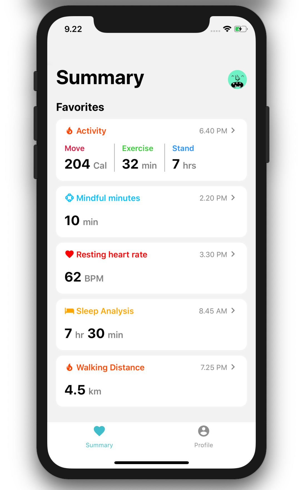
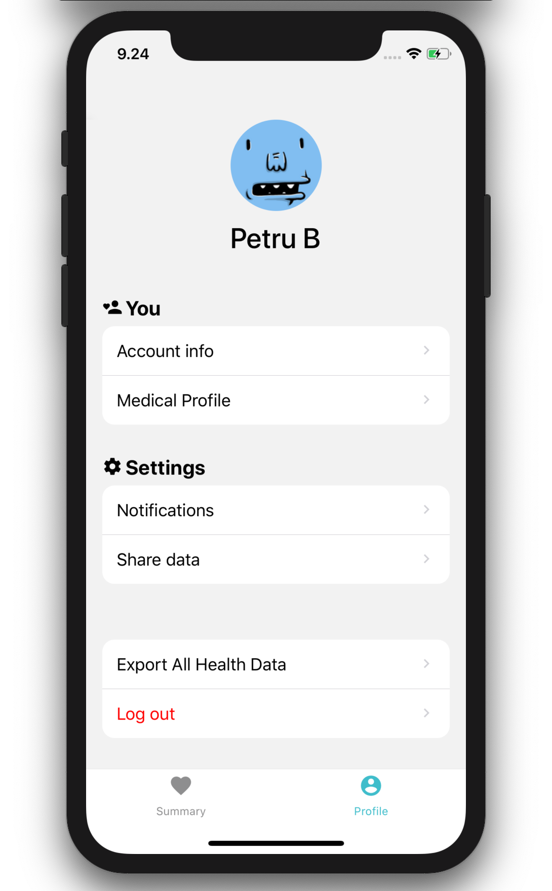

<p align="center">
  
</p>

# WalkSample - react-native app that mimics iOS Health

## What you need to run the demo locally (iOS)

- NodeJS v12.14
- npm v6.13
- XCode v11.3

> these are versions used in development, it should work fine with others

```bash
# install node modules
npm i;

# install Cocoa Pods
cd ios && pod install && cd ../;

# run app on default simulator (you can also start it through XCode opening "ios/WalkSample.xcworkspace")
npm run ios;
```

<p align="center">
  
</p>
